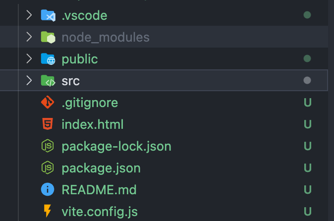
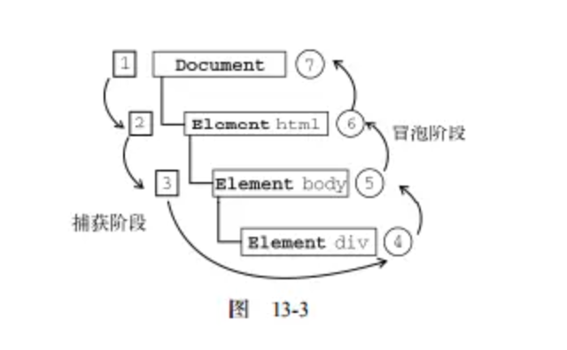
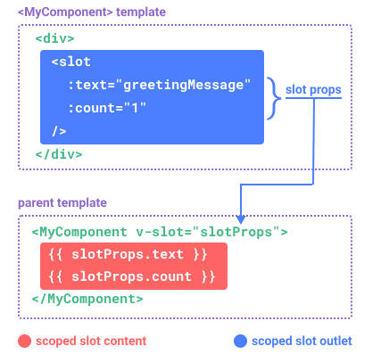

- [1. VueJS 3.0](#1-vuejs-30)
  - [1.1. 1.1 DOM (Document Object Model) 概述](#11-11-dom-document-object-model-概述)
- [2. Chapter 1: Vue Base](#2-chapter-1-vue-base)
  - [2.1. Precondition](#21-precondition)
  - [2.2. Create Vue Project](#22-create-vue-project)
  - [2.3. 安装`cnpm`](#23-安装cnpm)
- [3. Vue Project Structure](#3-vue-project-structure)
- [4. `Template` Syntax - 模版语法 `{{ }}`](#4-template-syntax---模版语法--)
  - [4.1. Text Interpolation - 文本插值 - `{{ variable }}`](#41-text-interpolation---文本插值----variable-)
  - [4.2. Using `JavaScript` Expressions - `{{ expression }}`](#42-using-javascript-expressions----expression-)
  - [4.3. 原始`HTML` - `v-html`](#43-原始html---v-html)
- [5. Attribute Bindings - 属性绑定 - `v-bind:attribute` | `:arrtribute`](#5-attribute-bindings---属性绑定---v-bindattribute--arrtribute)
    - [5.0.1. Shorthand - 简写](#501-shorthand---简写)
  - [5.1. Boolean Attributes - 布尔型 Attribute](#51-boolean-attributes---布尔型-attribute)
  - [5.2. Dynamically Binding Multiple Attributes - 动态绑定多个值](#52-dynamically-binding-multiple-attributes---动态绑定多个值)
- [6. Conditional Rendering - 条件渲染](#6-conditional-rendering---条件渲染)
  - [6.1. `v-if`](#61-v-if)
  - [6.2. `v-else`](#62-v-else)
  - [6.3. `v-else-if`](#63-v-else-if)
  - [6.4. `v-show`](#64-v-show)
  - [6.5. `v-if` VS `v-show`](#65-v-if-vs-v-show)
- [7. List Rendering - 列表渲染 `v-for`](#7-list-rendering---列表渲染-v-for)
  - [7.1. 复杂数据](#71-复杂数据)
  - [7.2. `v-for`对象](#72-v-for对象)
  - [7.3. 通过 key 管理状态 - `:key`](#73-通过-key-管理状态---key)
    - [7.3.1. key 的来源](#731-key-的来源)
- [8. Event Handing - 事件处理 - `v-on:event` |`@event`](#8-event-handing---事件处理---v-onevent-event)
  - [8.1. Inline Handlers - 内联事件处理器](#81-inline-handlers---内联事件处理器)
  - [8.2. Method Handlers - 方法事件处理器](#82-method-handlers---方法事件处理器)
  - [8.3. Method vs. Inline Detection - 方法事件 | 内联事件辨别](#83-method-vs-inline-detection---方法事件--内联事件辨别)
  - [8.4. 事件参数](#84-事件参数)
    - [8.4.1. 获取`event`对象](#841-获取event对象)
  - [8.5. 传递参数](#85-传递参数)
  - [8.6. 传递参数过程获取`event`](#86-传递参数过程获取event)
- [9. Event Modifiers - 事件修饰符](#9-event-modifiers---事件修饰符)
  - [9.1. 补充知识：`event.preventDefault()` 与 `event.stopPropagation()`](#91-补充知识eventpreventdefault-与-eventstoppropagation)
  - [9.2. 附录：表单｜事件｜按键修饰符修饰符详解](#92-附录表单事件按键修饰符修饰符详解)
  - [9.3. Examples](#93-examples)
    - [9.3.1. `.prevent` 阻止默认事件 \& `stop` 阻止事件进一步捕获或冒泡](#931-prevent-阻止默认事件--stop-阻止事件进一步捕获或冒泡)
- [10. Array Change Watchers - Detection](#10-array-change-watchers---detection)
  - [10.1. Method to change - 变更方法](#101-method-to-change---变更方法)
  - [10.2. 替换一个数组](#102-替换一个数组)
- [11. Computed Properties - 计算属性 `computed`](#11-computed-properties---计算属性-computed)
  - [11.1. 计算属性缓存 vs 方法](#111-计算属性缓存-vs-方法)
- [12. Class Binding - Class 绑定](#12-class-binding---class-绑定)
- [13. Style Banding - Style 绑定](#13-style-banding---style-绑定)
- [14. Wathcers - 侦听器](#14-wathcers---侦听器)
- [15. Form Input Bindings - 表单输入绑定 `v-model`](#15-form-input-bindings---表单输入绑定-v-model)
  - [15.1. Basic Usage - 基本用法](#151-basic-usage---基本用法)
  - [15.2. Value Bindings - 值绑定](#152-value-bindings---值绑定)
  - [15.3. Modifiers - 修饰符 `.lazy`, `.number`, `trim`](#153-modifiers---修饰符-lazy-number-trim)
    - [15.3.1. `.lazy`](#1531-lazy)
    - [15.3.2. `.number`](#1532-number)
    - [15.3.3. `.trim`](#1533-trim)
- [16. Template Refs - 模板引用 `ref`](#16-template-refs---模板引用-ref)
  - [16.1. Accessing the Refs - 访问模板引用](#161-accessing-the-refs---访问模板引用)
- [17. Components Basics - 组件组成](#17-components-basics---组件组成)
  - [17.1. 定义一个组件](#171-定义一个组件)
  - [17.2. 使用组件](#172-使用组件)
  - [17.3. 组件嵌套关系](#173-组件嵌套关系)
    - [17.3.1. 创建组件及引用关系](#1731-创建组件及引用关系)
- [18. Component Registration - 组件注册](#18-component-registration---组件注册)
  - [18.1. 全局注册(不写了，反正不推荐使用)](#181-全局注册不写了反正不推荐使用)
- [19. Props - 组件传递数据 - 父传子](#19-props---组件传递数据---父传子)
  - [19.1. 基础用法（静态\&动态）- 字符串声明形式 - String Declaration](#191-基础用法静态动态--字符串声明形式---string-declaration)
  - [19.2. 传递多种数据类型 - Passing Different Value Types](#192-传递多种数据类型---passing-different-value-types)
  - [19.3. 对象形式的 `props` 声明 \& Props 校验 - Object Declaration \& Prop Validation](#193-对象形式的-props-声明--props-校验---object-declaration--prop-validation)
    - [19.3.1. 对象形式的 `props` 声明](#1931-对象形式的-props-声明)
    - [19.3.2. Prop 校验](#1932-prop-校验)
- [20. 组件事件 - Component Events 子传父 - `this.$emit`](#20-组件事件---component-events-子传父---thisemit)
- [21. Component v-model - 组件 v-model](#21-component-v-model---组件-v-model)
- [22. 组件数据传递 - 使用`props`实现子传父 (好垃圾的方法。)](#22-组件数据传递---使用props实现子传父-好垃圾的方法)
- [23. Fallthrough Attributes - 透传 Attributes (不常用)](#23-fallthrough-attributes---透传-attributes-不常用)
- [24. Slots - 插槽 `<slot></slot>` (父传子)](#24-slots---插槽-slotslot-父传子)
  - [24.1. Basic](#241-basic)
  - [24.2. Render Scope - 渲染作用域](#242-render-scope---渲染作用域)
  - [24.3. Fallback Content - 插槽默认值](#243-fallback-content---插槽默认值)
  - [24.4. Named Slot - 具名插槽 `v-slot` | `#`](#244-named-slot---具名插槽-v-slot--)
- [25. Scoped Slots - 作用域插槽： 插槽内容中使用子组件域内数据](#25-scoped-slots---作用域插槽-插槽内容中使用子组件域内数据)
  - [25.1. 具体步骤：（非具名） `<ChildComponent v-slot='slotProps'>`](#251-具体步骤非具名-childcomponent-v-slotslotprops)
  - [25.2. 具体步骤 (具名) `<template #name="slotProps">`](#252-具体步骤-具名-template-nameslotprops)
- [26. Lifecycle Hook - 组件生命周期钩子](#26-lifecycle-hook---组件生命周期钩子)
  - [26.1. Lifecycle Diagram](#261-lifecycle-diagram)
  - [26.2. Options: Lifecycle](#262-options-lifecycle)
  - [26.3. Application of Lifecycle](#263-application-of-lifecycle)
    - [26.3.1. 通过 `ref` 获取元素 DOM 结构](#2631-通过-ref-获取元素-dom-结构)
    - [26.3.2. 模拟网络请求渲染数据](#2632-模拟网络请求渲染数据)
- [27. Dynamic Component - 动态组件 `<component :is="..."></component>`](#27-dynamic-component---动态组件-component-iscomponent)
- [28. 组件保持存活 - `<keep-alive></keep-alive>`](#28-组件保持存活---keep-alivekeep-alive)
- [29. Async Components - 异步组件](#29-async-components---异步组件)
- [30. Provide / Inject - 依赖注入](#30-provide--inject---依赖注入)
  - [30.1. `Provide` (提供)](#301-provide-提供)
  - [30.2. `Inject` (注入)](#302-inject-注入)
  - [30.3. 全局注入](#303-全局注入)
  - [30.4. 和响应式数据配合使用(不清楚具体作用)](#304-和响应式数据配合使用不清楚具体作用)
- [31. Vue Application - Vue 应用](#31-vue-application---vue-应用)
  - [重要概念](#重要概念)
  - [The application instance - 应用实例](#the-application-instance---应用实例)
  - [The Root Component - 根组件](#the-root-component---根组件)
  - [Mountig the App - 挂载应用](#mountig-the-app---挂载应用)
- [32. Glossary - 术语表](#32-glossary---术语表)


### NOTE
> 1. section 4.1-4.3: vue-base
> 2. section 5-17.1: vue-demo
> 3. setion 17.2-19: vue-component-qt
> 4. section 20-22: vue-component-event

# 1. [VueJS 3.0](https://cn.vuejs.org/)

## 1.1. 1.1 [DOM (Document Object Model) 概述](https://developer.mozilla.org/zh-CN/docs/Web/API/Document_Object_Model/Introduction)

# 2. Chapter 1: Vue Base

## 2.1. Precondition

> Versions of Node.js > 15.0
> [How to update Node.js](https://juejin.cn/post/7161634586824212488)
> Install `vue`: `npm install -g @vue/cli`

## 2.2. Create Vue Project

1. `npm init vue@latest`
   这一指令将会安装并执行`create-vue`，它是 Vue 官方的项目脚手架工具。执行后将会看到一些诸如 TypeScript 和测试支持之类的可选功能提示

```bash
✔ Project name: … vue-base
✔ Add TypeScript? … No / Yes
✔ Add JSX Support? … No / Yes
✔ Add Vue Router for Single Page Application development? … No / Yes
✔ Add Pinia for state management? … No / Yes
✔ Add Vitest for Unit Testing? … No / Yes
✔ Add an End-to-End Testing Solution? › No
✔ Add ESLint for code quality? … No / Yes
```

> 1. `Project name:` 项目名称，**不能存在大写**
> 2. `Add TypeScript?`: 是否添加`TypeScript`
> 3. `Add JSX Suppor?`: 是否添加`JSX`语法支持, `JSX`是`ReactJS`的特有文件后缀
> 4. `Add Vue Router for Single Page Application develipment?`: 是否添加 Vue 路由
> 5. `Add Pinia for state management?`: 是否添加`Pinia`状态管理
> 6. `Add Vitest for Unit Testing?` : 单元测试功能
> 7. `Add an End-to-End Testing Solution?` : 端对端测试
> 8. `Add ESLint for code quality? `: 代码质量相关

2. 项目创建完成后会提示执行一下命令：

```bash
Done. Now run:

  cd vue-base
  npm install # 安装dependencies
  npm run dev # 运行项目
```

## 2.3. 安装`cnpm`

> `cnpm` 是 `npm`的国内淘宝镜像，会比`npm`要快
>
> 1. 安装命令：`sudo npm install -g cnpm --registry=https://registry.npm.taobao.org`
> 2. 查看版本：`cnpm -v`

# 3. Vue Project Structure



```js
.vscode         --- VSCODE工具的配置文件
node_modules    --- Vue项目的运行依赖文件夹,执行npm install时，依赖文件会安装到这里
public          --- 资源文件夹（浏览器图标）
src             --- 源码文件夹
.gitignore      --- git忽略文件
index.html      --- 入口HTMl文件
package.json    --- 信息描述文件
README.md       --- 项目描述文件
vite.config.js  --- Vue配置文件
```

# 4. `Template` Syntax - 模版语法 `{{ }}`

> Vue 使用一种基于`HTML`的模版语法，使我们能够声明式地将其组件实例的数据绑定到呈现的 DOM 上，所有的`Vue`模版都是语法层面合法的`HTML`，可以被符合规范的浏览器和`HTML`解析器解析

## 4.1. Text Interpolation - 文本插值 - `{{ variable }}`

最基本的数据绑定形式时文本差值（Text Interpolation， 它使用的是 "Mustache" 语法（即双大括号 `{{ }}`）：

```html
<template>
    <p>{{ msg }}</p>
</template>

<script>
    export default {
        data() {
            return {
                msg: "神奇的魔法",
            };
        },
    };
</script>
```

## 4.2. Using `JavaScript` Expressions - `{{ expression }}`

每一个绑定仅支持单一表达式，也就是一段能够被求值的`JavaScript`代码。一个简单的判断代码是是否可以合法写在`return`后面。

```html
<template>
    <p>{{ number + 1 }}</p>
    <p>{{ ok ? 'Yes' : 'No' }}</p>
    <p>{{ mssage.split('').reverse().join('') }}</p>
</template>

<script>
    export default {
        data() {
            return {
                number: 10,
                ok: true,
                message: "大家好",
            };
        },
    };
</script>
```

## 4.3. 原始`HTML` - `v-html`

双大括号将会将数据插值为纯文本，而不是`HTML`。若想插入`HTML`，则需要使用`v-html`指令

```html
<template>
    <p>纯文本: {{ rawHtml }}</p>
    <p>
        属性：
        <span v-html="rawHtml"></span>
    </p>
</template>
<script>
    export default {
        data() {
            return {
                rawHtml: "<a href='https://www.google.com'>Google</a>",
            };
        },
    };
</script>
```

# 5. Attribute Bindings - 属性绑定 - `v-bind:attribute` | `:arrtribute`

文本差值`{{}}`不能用在`HTML` attributes 中。想要响应式地绑定一个 attribute,应该使用`v-bind`指令

```html
<template>
    <div v-bind:id="dynamicId" v-bind:class="dynamicClass">Test</div>
</template>

<script>
    export default {
        data() {
            return {
                dynamicClass: "appClass",
                dynamicId: "appID",
            };
        },
    };
</script>

<style>
    .appClass {
        color: red;
        font-size: 30px;
    }
</style>
```

`v-bind`指令指示 Vue 将元素的`id`attribute 与组件的`dynamicId`属性保持一致。如果绑定的值是`null`或者`undefined`，那么该 attribute 将会从渲染的元素上移除

### 5.0.1. Shorthand - 简写

因为`v-bind`非常常用，我们提供了特定的简写语法

```html
<div :id="dynamicId" :class="dynamicClass"></div>
```

## 5.1. Boolean Attributes - 布尔型 Attribute

布尔型 attribute 依据 true/false 值来决定 attribute 是否应该存在于该元素上，`disabled`就是最常见的例子之一

```html
<button :disabled="isButtonDisabled">Button</button>
```

## 5.2. Dynamically Binding Multiple Attributes - 动态绑定多个值

如果你有像这个一个包含多个 attribute 的 `JavaScript` 对象

```js
const objectOfAttrs = {
    id: "container",
    class: "wrappper",
};
```

通过不带参数的 v-bind，你可以将它们绑定到单个元素上：

```html
<div v-bind="objectOfAttrs"></div>
```

# 6. Conditional Rendering - 条件渲染

-   `v-if`
-   `v-else`
-   `v-else-if`
-   `v-show`

## 6.1. `v-if`

`v-if` 指令用于条件性地渲染一块内容。这块内容只会在指令的表达式返回真值时才被渲染

## 6.2. `v-else`

也可以使用`v-else`为`v-if`添加一个“else 区块“

> 一个元素`v-else`必须跟在一个`v-if`或者`v-else-if`元素后面，否则它将不会被识别。

## 6.3. `v-else-if`

顾名思义，`v-else-if` 提供的是相应于`v-if`的"else if 区块“。它可以连续多次重复使用

> 和`v-else`类似，一个使用`v-else-if`的元素必须紧跟在一个`v-if`或一个`v-else-if`元素后面

## 6.4. `v-show`

另一个可以用来按条件显示一个元素的指令是`v-show`。其用法基本一样：

不用之处在于`v-show`会在 DOM 渲染中保留该元素；`v-show`仅切换了该元素上名为`display`的 CSS 属性。

`v-show` 不支持在`<template>`元素上使用，也不能和`v-else`搭配使用。

## 6.5. `v-if` VS `v-show`

`v-if` 是"真实的"按条件渲染，因为它确保了在切换时，条件区块内的条件监听器和子组件都会被销毁与重建。
`v-if` 也是**惰性**的：如果在初次渲染时条件值为 false，则不会做任何事。条件区块只有当条件首次变为 true 时才被渲染。‘
相比之下，`v-show`简单许多，元素无论初始条件如何，始终会被渲染，只有 CSS`display`属性会被切换。
总的来说，`v-if`有更高的切换开销，而`v-show`有更高的初始渲染开销。因此，如果需要频繁切换，则使用`v-show`较好；如果运行时绑定条件很少改变，则`v-if`会更为合适。

```html
<template>
    <h3>Conditional Rendering</h3>
    <div v-if="flag">Can u see me ?</div>
    <div v-else>Then u should see me</div>
    <div v-if="type === 'A'">A</div>
    <div v-else-if="type === 'B'">B</div>
    <div v-else-if="type === 'C'">C</div>
    <div v-else>Not A/B/C</div>
    <div v-show="flag">Can u see me ?</div>
</template>

<script>
    export default {
        data() {
            return {
                flag: true,
                type: "B",
            };
        },
    };
</script>
```

# 7. List Rendering - 列表渲染 `v-for`

我们可以使用`v-for`指令基于一个数组来渲染一个列表。`v-for`指令的值需要使用`item in items`形式的特殊语法，其中`items`是源数据的数组，`item`是迭代项的别名.
在`v-for`快中可以完整地访问父作用域内的数据和变量。`v-for`也支持可选的第二个参数表示当前项的位置索引。

```html
<template>
    <h3>List Rendering</h3>
    <p v-for="name in names">{{ name }}</p>
</template>

<script>
    export default {
        data() {
            return {
                names: ["Chris", "Lyrics", "Murphy"],
            };
        },
    };
</script>
```

## 7.1. 复杂数据

大多数情况，我们渲染的数据源来源于网络请求，也就是`JSON`格式

```html
<template>
    <h3>List Rendering</h3>
    <div v-for="item in results">
        <p>{{ item.title }}</p>
        <!-- 属性绑定 -->
        
    </div>
</template>

<script>
    export default {
        data() {
            return {
                results: [
                    {
                        id: 2261677,
                        title: "鄂尔多斯｜感受一座城市的璀璨夜景 感受一座城市，除了白日里的车水马龙，喧嚣繁华之",
                        avator: "https://pic.qyer.com/avatar/002/25/77/30/200?v=1560226451",
                    },
                    {
                        id: 2261566,
                        title: "成都这家洞穴暗黑风咖啡厅酷毙了！！早C晚A走起☕️ 成都天气这么🔥 咖啡🌟人必备",
                        avator: "https://pic.qyer.com/avatar/002/25/77/30/200?v=1560226451",
                    },
                    {
                        id: 2261662,
                        title: "[川西新龙-措卡湖]措卡湖吗，意为“乱世从中的黑色海水”，神秘小众 原汁原味。",
                        avator: "https://pic.qyer.com/avatar/002/25/77/30/200?v=1560226451",
                    },
                ],
            };
        },
    };
</script>
```

`v-for`也支持使用可选的第二个参数表示当前项的位置索引

```html
<template>
    <h3>List Rendering</h3>
    <p v-for="(item, index) in names">{{ item }} - {{ index }}</p>
</template>

<script>
    export default {
        data() {
            return {
                names: ["Chris", "Lyrics", "Murphy"],
            };
        },
    };
</script>
```

也可以使用`of`作为分隔符来替代`in`,这更接近 `JavaScript` 的迭代器语法

```html
<div v-for="item of items"></div>
```

## 7.2. `v-for`对象

也可以使用`v-for`来遍历一个对象的所有属性

```html
<template>
    <h3>List Rendering</h3>
    <!-- 默认遍历顺序 -->
    <div v-for="(value, key, index) in userInfo">
        <p>{{ index }}- {{ key }}-{{ value }}</p>
    </div>
    <!-- <p>{{ userInfo.name }}-{{ userInfo.age }}-{{ userInfo.sex }}</p> -->
</template>

<script>
    export default {
        data() {
            return {
                userInfo: {
                    // key : value
                    name: "iwen",
                    age: 20,
                    sex: "male",
                },
            };
        },
    };
</script>
```

## 7.3. 通过 key 管理状态 - `:key`

`Vue`默认按照“就地更新”的策略来更新通过`v-for`渲染的元素列表。当数据项的顺序改变时，`Vue`不会随之移动 DOM 元素的顺序，而是就地更新每个元素，确保他们在原本制定的索引位置上渲染。
为了给`Vue`一个提示，以便它可以跟踪每个节点的标识，从而重用和重新排序现有的元素，你需要为每个元素对应的块提供一个唯一的`key` attribute:

> 个人理解：key 绑定的作用就是告诉`Vue`在渲染的时候基于什么来给数据项建立索引，默认情况下是按照其定义顺序（代码顺序），这样如果代码顺序发生改变，在没有 key 的情况下，为了确保数据随之更新，`Vue`会重新渲染所有数据，并更新所有数据对应的索引（即便有些数据没有任何更新-浪费资源）。如果提供的 key，则`Vue`会根据 key 提供的 attribute 来建立索引，这样就算数据发生改变，原本顺序没有发生变化的某些数据则不会进行更新，只更新索引和 key 在更新后不匹配的部分，从而节省资源。

```html
<template>
    <h3>v-for Status Management by key</h3>
    <p v-for="(item, index) in names" :key="index">{{ index }}-{{ item }}</p>
</template>
<script>
    export default {
        data() {
            return {
                names: ["Chris", "Lyrics", "Murphy"],
            };
        },
    };
</script>
```

> **温馨提示**
>
> 1. `key`在这里是通过一个`v-bind`绑定特殊的 attribute
> 2. 推荐在任何可行的时候为`v-for`提供一个`key` attribute
> 3. `key`绑定的值最好是一个基础类型的值，例如字符串或者 number 类型

### 7.3.1. key 的来源

在真实的应用场景中，不推荐使用`index`作为 key，要确保每一条数据的唯一索引不会发生变化(例如使用`id`)

```html
<template>
    <h3>v-for Status Management by key</h3>
    <div v-for="item in results" :key="item.id">
        <p>{{ item.title }}</p>
        
    </div>
</template>
<script>
    export default {
        data() {
            return {
                results: [
                    {
                        id: 2261677,
                        title: "鄂尔多斯｜感受一座城市的璀璨夜景 感受一座城市，除了白日里的车水马龙，喧嚣繁华之",
                        avator: "https://pic.qyer.com/avatar/002/25/77/30/200?v=1560226451",
                    },
                    {
                        id: 2261566,
                        title: "成都这家洞穴暗黑风咖啡厅酷毙了！！早C晚A走起☕️ 成都天气这么🔥 咖啡🌟人必备",
                        avator: "https://pic.qyer.com/avatar/002/25/77/30/200?v=1560226451",
                    },
                    {
                        id: 2261662,
                        title: "[川西新龙-措卡湖]措卡湖吗，意为“乱世从中的黑色海水”，神秘小众 原汁原味。",
                        avator: "https://pic.qyer.com/avatar/002/25/77/30/200?v=1560226451",
                    },
                ],
            };
        },
    };
</script>
```

# 8. Event Handing - 事件处理 - `v-on:event` |`@event`

我们可以使用`v-on`指令（简写`@`）来监听 DOM 事件，并在实践触发时执行对应的`JavaScript`.用法：`v-on:click="methodName"`或`@click='handler'`
事件处理器的值可以是

1. 内联事件处理器： 事件被触发时执行的内联 `JavaScript` 语句（与`onclick`类似）
2. 方法事件处理器： 一个指向组件上定义的方法的属性名或是路径

## 8.1. Inline Handlers - 内联事件处理器

内联事件处理器通常用于简单场景

```html
<template>
    <button @click="count++">Add 1</button>
    <p>Count is: {{ count }}</p>
</template>

<script>
    export default {
        data() {
            return {
                count: 0,
            };
        },
    };
</script>
```

## 8.2. Method Handlers - 方法事件处理器

方法事件处理器自动接收原生 DOM 事件并触发执行。

```html
<template>
    <h3>Methode event handler</h3>
    <button @click="addCount">Add</button>
    <p>Count is: {{ count }}</p>
</template>

<script>
    export default {
        data() {
            return {
                count: 0,
            };
        },
        methods: {
            addCount() {
                this.count += 1;
            },
        },
    };
</script>
```

## 8.3. Method vs. Inline Detection - 方法事件 | 内联事件辨别

模版编译器会通过检查`v-on`的值是否是合法的`JavaScript`标识符或属性访问路径来断定是何种形式的事件处理器。举例俩说，`foo`, `foo.bar` 和`foo['bar']`会被视为方法事件处理器，而`foo()`,`count++` 会被视为内联事件处理器。

## 8.4. 事件参数

事件参数可以获取`event`对象和通过事件传递数据

### 8.4.1. 获取`event`对象

```html
<template>
    <h3>Method event handler</h3>
    <button @click="addCount">Add</button>
    <p>Count is: {{ count }}</p>
</template>

<script>
    export default {
        data() {
            return {
                count: 0,
            };
        },
        // All method and function placed here
        methods: {
            addCount(e) {
                // using this to refer variable in data()
                this.count++;
                // Event object in vue is the original JS object
                console.log((e.target.innerHTML = "Add " + this.count));
            },
        },
    };
</script>
```

## 8.5. 传递参数

```html
<template>
    <h3>Method event handler</h3>
    <button @click="addCount('hello')">Add</button>
    <p>Count is: {{ count }}</p>
</template>

<script>
    export default {
        data() {
            return {
                count: 0,
            };
        },
        // All method and function placed here
        methods: {
            addCount(msg) {
                // using this to refer variable in data()
                this.count++;
                console.log(msg);
            },
        },
    };
</script>
```

## 8.6. 传递参数过程获取`event`

```html
<template>
    <h3>Passing Argument in Event Handler 2</h3>
    <p
        @click="getNameHandler(item, $event)"
        v-for="(item, index) in names"
        :key="index">
        {{ item }}
    </p>
</template>

<script>
    export default {
        data() {
            return {
                names: ["iwen", "ime", "frank"],
            };
        },
        // All method and function placed here
        methods: {
            getNameHandler(name, e) {
                // using this to refer variable in data()
                console.log(name);
                console.log(e);
            },
        },
    };
</script>
```

# 9. Event Modifiers - 事件修饰符

在处理事件时调用`event.preventDefault()`或`event.stopPropagation()`是很常见的。尽管我们可以直接在方法内调用，但如果方法能更专注于数据逻辑而不用处理 DOM 事件的细节会更好。
为解决这一问题，Vue 为`v-on`提供了事件修饰符。

## 9.1. 补充知识：`event.preventDefault()` 与 `event.stopPropagation()`

事件处理程序分三个阶段：捕获阶段，“处于目标”阶段, 冒泡阶段。



在所有 DOM 节点中都包含事件监听`addEventListener()` 和 `removeEventListener()` 这两个方法，并且它们都接受 3 个参数：要处理的事情名（eventnName），作为事件处理程序的函数(function) 和一个布尔值 (true|false)。如果布尔值是 true，则在捕获阶段调用事件处理程序；如果是 false，表示在冒泡阶段调用事件处理程序。默认为冒泡阶段调用事件处理程序(false)，即事件触发是从目标组件开始自下而上。(div->body)

基于此，`event.preventDefault()` 方法的作用是：取消事件的默认行为，即在捕获(当布尔值为 true)或冒泡(false)阶段不调用默认的事件处理程序。

> 使用场景如：当鼠标右键按下的时候会出现默认菜单，如果此时你想定义自己的方法就可以使用 `event.preventDefault()`;

而 `event.stopPropagation()` 则是取消事件的进一步捕获(当布尔值为 true)或冒泡(false)。

> 使用场景如（布尔值为 false）：div 和 body 同时添加 click 事件，要想当点击 div 时，不触发 body 的事件，只要在 div 执行语句之后使用 `event.stopPropagation()`即可不触发 body 的事件。

修饰符是用`.`表示的指令后缀，包含以下这些：

-   `.stop`: 相当于调用`event.stopPropagation()`
-   `.prevent`: 相当于调用`event.preventDefault()`
-   `.self`: 类似于`event.stopPropagation()`，只当事件是从事件绑定的元素本身触发时才触发回调。
-   `.capture`，相当于将布尔值设为 true, 即事件从捕获阶段开始触发，添加的该后缀的事件触发为自上而下(body->div)
-   `.once`: 元素绑定的事件只能触发一次。
-   `.passive`:当我们在监听元素滚动事件的时候，会一直触发`onscroll`事件，在移动端，会让我们的网页变卡，因此我们使用这个修饰符的时候，相当于给`onscroll`事件整了一个`.lazy`修饰符.
-   `native`: `Vue`组件绑定的事件一般是不会触发的，添加`native`可以理解为该修饰符的作用就是把一个 `vue` 组件转化为一个普通的 HTML 标签，使得事件可以触发。

```html
<!-- 单击事件将停止传递（进一步捕获或冒泡） -->
<a @click.stop="doThis"></a>

<!-- 阻止默认事件 -->
<form @submit.prevent="onSubmit"></form>

<!-- 修饰语可以使用链式书写，但要注意顺序 -->
<a @click.stop.prevent="doThat"></a>

<!-- 也可以只有修饰符 -->
<form @submit.prevent></form>

<!-- 仅当 event。target 是元素本身时才会触发事件处理器 -->
<!-- 例如：事件处理器不来自子元素 -->
<div @click.self="doThat">...</div>
```

## 9.2. 附录：[表单｜事件｜按键修饰符修饰符详解](https://segmentfault.com/a/1190000016786254)

## 9.3. Examples

### 9.3.1. `.prevent` 阻止默认事件 & `stop` 阻止事件进一步捕获或冒泡

```html
<template>
    <h3>Evnet Modifiers</h3>
    <a @click.prevent="clickHandle" href="http://www.google.com">Google</a>
    <div @click="clickDiv">
        <p @click.stop="clickP">测试冒泡</p>
    </div>
</template>

<script>
    export default {
        data() {
            return {};
        },
        methods: {
            clickHandle(e) {
                // 阻止默认事件
                // e.preventDefault();
                console.log("Clicked");
            },
            clickDiv() {
                console.log("DIV clicked");
            },
            clickP() {
                console.log("P clicked");
            },
        },
    };
</script>
```

# 10. Array Change Watchers - Detection

## 10.1. Method to change - 变更方法

Vue 能够侦听响应式数组的一些变更方法，并在它们被调用时触发相关的更新。这些变更方法包括：

-   `push()`
-   `pop()`
-   `shift()`
-   `unshift()`
-   `splice()`
-   `sort()`
-   `reverse()`

## 10.2. 替换一个数组

相对地，也有一些不可变(immutable)方法，例如`filter()`, `concat()` 和 `slice()`，这些不会更改原数组，而总是返回一个新数组。当遇到的是非变更方法时，我们需要将旧的数组替换为新的

```html
<template>
    <h3>Array Change Watchers</h3>
    <p v-for="(item, index) in names" :key="index"></p>
    <button @click="addLikstHandle">Add Data</button>
    <ul>
        <li v-for="(item, index) in names" :key="index">{{ item }}</li>
    </ul>
    <button @click="ConcatHandle">Concat Array</button>
    <h3>Array 1</h3>
    <p v-for="(item, index) in nums1" :key="index">{{ item }}</p>
    <h3>Array 2</h3>
    <p v-for="(item, index) in nums2" :key="index">{{ item }}</p>
</template>

<script>
    export default {
        data() {
            return {
                names: ["iwen", "ime", "frank"],
                nums1: [1, 2, 3, 4, 5],
                nums2: [6, 7, 8, 9, 10],
            };
        },
        methods: {
            addLikstHandle() {
                // 引起UI自动更新
                this.names.push("sakura");
                // 不会引起UI自动更新;
                this.names.concat(["sakura"]); // concat会生成一个新的数组，原数组不会发生变化
                console.log(this.names);
                // 将concat生成的新数组赋给names, 引起UI更新;
                this.names = this.names.concat(["sakura"]);
            },
            ConcatHandle() {
                this.nums1 = this.nums1.concat(this.nums2);
            },
        },
    };
</script>
```

# 11. Computed Properties - 计算属性 `computed`

模版中的表达式虽然方便，但也只能用来做简单的操作。如果在模版中写太多逻辑，会让模版变得臃肿，难以维护。因此我们推荐使用**计算属性**来描述依赖响应式状态的复杂逻辑。

## 11.1. 计算属性缓存 vs 方法

理论上，函数｜方法也能达到相同的效果，不同点在于，计算属性值会基于其响应式依赖被缓存。一个计算属性仅会在其响应式依赖更新时才重新计算，而方法调用总是会在重新渲染发生时再次执行函数。

> **在依赖不更新情况下，计算属性多次调用但只有一次计算，方法在几次调用就有几次计算。**

```html
<template>
    <h3>{{ itbaizhan.name }}</h3>
    <p>{{ itbaizhanContent }}</p>
    <p>{{ itbaizhanContents() }}</p>
</template>

<script>
    export default {
        data() {
            return {
                itbaizhan: {
                    name: "BaizhanProgrammer",
                    content: ["Front-end", "Java", "python"],
                },
            };
        },
        // Computed Property
        computed: {
            itbaizhanContent() {
                return this.itbaizhan.content.length > 0 ? "Yes" : "No";
            },
        },
        methods: {
            itbaizhanContents() {
                return this.itbaizhan.content.length > 0 ? "Yes" : "No";
            },
        },
    };
</script>
```

# 12. Class Binding - Class 绑定

绑定 CSS Class 列表是数据绑定的一个常见需求场景，但是在处理比较复杂的绑定时，通过拼接字符串时麻烦且容易出错的。因此，Vue 专门为 `class` 的 `v-bing` 用法提供了特殊的功能增强。除了字符串外，表达式的值也可以是**对象**或**数组**。

```html
<template>
    <p :class="{ active: isActive, 'text-danger': hasError }">
        Class Binding 1
    </p>
    <p :class="classObject">Class Binding 2</p>
    <p :class="[arrActive, arrHasError]">Class Binding 3</p>
    <p :class="[isActive ? 'active' : '', hasError ? 'text-danger' : '']">
        Class Binding 4
    </p>
    <p :class="[isActive ? 'active' : '', { 'text-danger': hasError }]">
        Class Binding 5
    </p>
</template>
<script>
    import { isReactive } from "vue";

    export default {
        data() {
            return {
                // 属性绑定布尔值, 条件渲染
                isActive: true,
                hasError: true,
                // 将属性创建为对象
                classObject: {
                    active: true,
                    "text-danger": true,
                },
                // 数组，非条件渲染
                arrActive: "active",
                arrHasError: "text-danger",
            };
        },
    };
</script>

<style>
    .active {
        font-size: 30px;
    }
    .text-danger {
        color: red;
    }
</style>
```

> **Tips**
> 数组和对象嵌套过程中，只能是数组嵌套对象，不能反其道而行之。

# 13. Style Banding - Style 绑定

Vue 所提供的对于 Style 绑定的功能增强和和 Class 绑定相同，除了字符串外，表达式的值也可以是**对象**或**数组**。

```html
<template>
    <p :style="{ color: activeColor, fontSize: fontSize + 'px' }">
        Style Binding 1
    </p>
    <p :style="styleObject">Style Binding 2</p>
</template>
<script>
    export default {
        data() {
            return {
                activeColor: "green",
                fontSize: 30,
                styleObject: {
                    color: "red",
                    fontSize: "30px",
                },
            };
        },
    };
</script>
```

# 14. Wathcers - 侦听器

计算属性允许我们声明性地计算衍生值。然而在有些情况下，我们需要在状态变化时执行一些“副作用”：例如更改 DOM，或是根据异步操作的结果去修改另一个状态。
在组合式 API 中，我们可以使用`watch`函数在每次响应式状态（花括号`{{ }}`调用的响应式数据）发生变化时触发回调函数：

```html
<template>
    <h3>Watchers</h3>
    <p>{{ message }}</p>
    <button @click="updateHandle">Change data</button>
</template>
<script>
    export default {
        data() {
            return {
                message: "Hello",
            };
        },
        methods: {
            updateHandle() {
                this.message += "World";
            },
        },
        watch: {
            // watch 函数名要与对应的响应式数据名相同
            message(newValue, oldValue) {
                // 固定格式

                // 数据发生变化时执行的逻辑
                console.log(newValue, oldValue);
            },
        },
    };
</script>
```

# 15. Form Input Bindings - 表单输入绑定 `v-model`

## 15.1. Basic Usage - 基本用法

表单输入绑定的功能是将表单输入框(包括 `<input>`, `<textarea>` `<select>`)的内容实时自动同步给 Javascript 中相应的变量.

```js
<!-- Form input bindings v-model -->
<template>
    <!-- binding input -->
    <h3>Form Input Bindings</h3>
    <form action="">
        <p>Message is: {{ message }}</p>
        <input type="text" v-model="message" placeholder="edit me">
    </form>

    <form action="">
        <input type="checkbox" id="checkobx" value="Hey" v-model="checked" >
        <label for="checkobx">{{ checked }}</label>
    </form>
    <!-- binding textarea -->
    <form action="">
        <span>Multiline message is:</span>
        <p>{{ message1 }}</p>
        <textarea name="" id="" cols="50" rows="10" v-model="message1"></textarea>
    </form>
    <!-- binding checkbox to array or set, value will be send to checkedNamed once checkbox is set to true -->
    <form action="">
        <div>Checked names: {{ checkedNames }}</div>

        <input type="checkbox" id="jack" value="Jack" v-model="checkedNames">
        <label for="jack">Jack</label>

        <input type="checkbox" id="john" value="John" v-model="checkedNames">
        <label for="john">John</label>

        <input type="checkbox" id="mike" value="Mike" v-model="checkedNames">
        <label for="mike">Mike</label>

    </form>
    <!-- binding radio checkbox to array or set -->
    <form action="">
        <div>Picked: {{ picked }}</div>

        <input type="radio" id="one" value="One" v-model="picked" />
        <label for="one">One</label>

        <input type="radio" id="two" value="Two" v-model="picked" />
        <label for="two">Two</label>
    </form>
    <!-- binding select to array or set -->
    <form action="">
        <div>Selected: {{ selected }}</div>
        <select name="" id="" v-model="selected">
            <option disabled value="">Please select one</option>
            <option value="Apple">A</option>
            <option value="Bananas">B</option>
            <option value="Cat">C</option>

        </select>
    </form>
    <!-- Binding multiple select to array or set -->
    <form action="">
        <div>Multi-Selected: {{ selected1 }}</div>
        <select name="" id="" multiple v-model="selected1">
            <option value="Apple">A</option>
            <option value="Bpple">B</option>
            <option value="Cpple">C</option>
        </select>
    </form>

    <!-- Rendering by v-for -->
    <form action="">
        <div>Selected: {{ selected2 }}</div>
        <select name="" id="" v-model="selected2">
            <option v-for="option in options" :value="option.value">
            {{ option.text }}
        </option></select>

    </form>
</template>

<script>
export default {
    data() {
        return {
            message: '',
            checked: true,
            message1: '',
            checkedNames: [],
            picked: [],
            selected: [],
            selected1: [],
            selected2: 'A',
            options: [
                {text: 'One', value: 'A'},
                {text: 'Two', value: 'B'},
                {text: 'Three', value: 'C'},
                {text: ' asd', value: '613'}
            ]
        };
    },
    methods:{

        }
}

</script>
```

## 15.2. Value Bindings - [值绑定](https://cn.vuejs.org/guide/essentials/forms#form-input-bindings)

1. 如果`v-model`绑定的是字符串(一般用在`<input>`, `<textarea>`),则同步的值为 input 输入框编辑的值.(实际就是`value`的值)
2. 如果`v-model`绑定的是布尔值(一般用在`<checkbox>`),则同步的值为 input 触发的布尔值 `true|false`.(也是` value``值，但对于checkbox ` `value`只有 true 和 false)
3. 如果`v-model`绑定的是 array(用在`<select>`, <input type='radio'>),则同步的值为对应的`value`属性值.

## 15.3. Modifiers - 修饰符 `.lazy`, `.number`, `trim`

### 15.3.1. `.lazy`

默认情况下， `v-model` 会在每次`input`事件后更新数据。你可以添加`.lazy`修饰符来改为每次`change`事件后更新数据。

### 15.3.2. `.number`

如果你想让用户输入自动转换为数字，你可以在 v-model 后添加 .number 修饰符来管理输入

```js
<input v-model.number="age" />
```

> 如果该值无法被 parseFloat() 处理，那么将返回原始值。
>
> number 修饰符会在输入框有 type="number" 时自动启用。

### 15.3.3. `.trim`

如果你想要默认自动去除用户输入内容中两端的空格，你可以在 v-model 后添加 .trim 修饰符```js

```js
<input v-model.trim="msg" />
```

# 16. Template Refs - 模板引用 `ref`

> **作用：在`Vue`中直接访问底层`DOM`元素**

`ref` 是一个特殊的 attribute,和`v-for`章节提到的`key`类似。它允许我们在一个特定的 DOM 元素或子组件实例被挂载后，获得对它的直接引用。这样的用处比如在组件挂载时将焦点设置到一个 input 元素上，或在一个元素上初始化一个第三方库

## 16.1. Accessing the Refs - 访问模板引用

挂载结束后引用都会被暴露在`this.$refs`之上：

```js

<template>
    <div ref="container" class="container">{{ content }}</div>
    <input type="text" ref="username">
    <button @click="getElementHandle">获取元素</button>
</template>
/** 在vue中对DOM的基本操作
 * 内容改变： {{ 模板语法 }}
 * 属性改变： v-bind: 指令
 * 事件: v-on:
 * 如果没有特别的需求，不要操作DOM
 */
<script>
export default {
    data() {
        return {
            content:"content"
        };
    },
    methods: {
        getElementHandle() {
            console.log(this.$refs.container)
            console.log(this.$refs.container.innerHTML = 'asdas')
            // this.content = "tuqioq"
            console.log(this.$refs.username.value)
        }
    }
}
</script>
```

# 17. Components Basics - 组件组成

## 17.1. 定义一个组件

```js
<template>
    <div class="container">{{ message }}</div>
</template>
<script>
export default {
    data() {
        return {
            message: 'asdasd',
        }
    }
}
</script>
<!-- scope: 让当前样式只在当前组件中生效 -->
<style scoped>
.container{
    font-size: 30px;
    color: **red**
}
</style>
```

## 17.2. 使用组件

```js
<script>
// 1. import component
import ComponentBasic from "./components/ComponentBasic.vue";

export default {
    // 2. injection of component
    components: {
        ComponentBasic
    }
}

</script>

<template>
    <!-- 3. display component -->
    <ComponentBasic/>
    <component-basic/>
</template>

```

## 17.3. 组件嵌套关系

组件允许我们将 UI 划分为独立的、可重用的部分，并且可以对每个部分进行单独的思考。在实际应用中，组件常常被组织成层层嵌套的树状结构：


这和我们嵌套 HTML 元素的方式类似，Vue 实现了自己的组件模型，使我们可以在每个组件内封装自定义内容与逻辑。Vue 同样也能很好地配合原生 Web Component。如果你想知道 Vue 组件与原生 Web Components 之间的关系，可以[阅读此章节](https://cn.vuejs.org/guide/extras/web-components.html)。

### 17.3.1. 创建组件及引用关系

-   Article

```js
<template>
    <h3>Article</h3>
</template>
<style scoped>
h3 {
    width: 80%;
    margin: 0 auto;
    text-align: center;
    line-height: 100px;
    box-sizing: border-box;
    margin-top: 50px;
    background: #999;
}
</style>
```

-   Main

```js
<template>
    <div class="main">
        <h3>Main</h3>
        <Article />
        <Article />
    </div>
</template>
<script>
import Article from "./Article.vue";
export default {
    components: {
        Article,
    },
};
</script>
<style scoped>
.main {
    float: left;
    width: 70%;
    height: 600px;
    border: 5px solid #999;
    box-sizing: border-box;
}
</style>
```

-   Item

```js
<template>
    <h3>Item</h3>
</template>
<style scoped>
h3 {
    width: 80%;
    margin: 0 auto;
    text-align: center;
    line-height: 100px;
    box-sizing: border-box;
    margin-top: 10px;
    background: #999;
}
</style>
```

-   Aside

```js
<template>
    <div class="aside">
        <h3>Aside</h3>
        <Item />
        <Item />
        <Item />
    </div>
</template>
<script>
import Item from "./Item.vue";
export default {
    components: {
        Item,
    },
};
</script>
<style scoped>
.aside {
    float: right;
    width: 30%;
    height: 600px;
    border: 5px solid #999;
    box-sizing: border-box;
    border-left: 0;
}
</style>
```

-   Header

```js
<template>
    <h3>Header</h3>
</template>
<style scoped>
h3 {
    width: 100%;
    height: 100px;
    border: 5px solid #999;
    text-align: center;
    line-height: 100px;
    box-sizing: border-box;
}
</style>

```

-   App

```js
<template>
    <Header />
    <Main />
    <Aside />
</template>

<script>
// Local Registration
import Header from "./pages/Header.vue";
import Main from "./pages/Main.vue";
import Aside from "./pages/Aside.vue";
import Parent from "./components/Parent.vue";
export default {
    components: {
        Parent,
        Header,
        Main,
        Aside,
    },
};
</script>
<style></style>
```

# 18. Component Registration - 组件注册

一个 Vue 组件在使用前需要先被“注册”，这样 Vue 才能在渲染模板时找到其对应的实现。组件注册有两种方式：**全局注册**和**局部注册**。(这个笔记之前的所有注册方式都是局部注册)

## 18.1. 全局注册(不写了，反正不推荐使用)

# 19. Props - 组件传递数据 - 父传子

组件与组件之间不是完全独立的，而是有交集的，那就是组件与组件之间是可以传递数据的，传递数据的解决方式就是`props`

## 19.1. 基础用法（静态&动态）- 字符串声明形式 - String Declaration

-   父组件： 注册（引用）子组件，并传递相关数据。

```js

<template>
    <h3>Parent</h3>
    <!-- Transfer data to child vue -->
    <Child title="Parent Data" demo="data" :dynamic="message" />
</template>
<script>
import Child from "./Child.vue";
export default {
    data() {
        return {
            message: "Dynamic Data",
        };
    },
    components: {
        Child,
    },
};
</script>
```

-   子组件：定义`props`，调用父组件传递的数据。

```js
<template>
    <h3>Child</h3>
    <!-- use data by template syntax -->
    <p>{{ title }}</p>
    <p>{{ demo }}</p>
    <p>{{ dynamic }}</p>
</template>
<script>
export default {
    data() {
        return {};
    },
    // invoke data from Parent, format: string declaration ["string"]
    props: ["title", "demo", "dynamic"],
};
</script>
```

> 注意事项：
> `props`传递数据，只能从 运行 `import component` 的组件传递到被 `import` 的组件，不能反其道而行

## 19.2. 传递多种数据类型 - Passing Different Value Types

对于动态传递，任何类型的值都可以作为 `props` 的值被传递。
Parent

```js
<template>
    <h3>Parent</h3>
    <!-- Transfer data (title) to child vue -->
    <Child
        title="Parent Data"
        demo="data"
        :dynamic="message"
        :age="age"
        :names="names"
        :userInfo="userInfo" />
</template>
<script>
import Child from "./Child.vue";
export default {
    data() {
        return {
            // dynamic data
            message: "Dynamic Data",
            age: 20, // number
            names: ["iwen", "amy", "frank"], // array
            userInfo: {
                // object
                name: "iwen",
                age: 20,
            },
        };
    },
    components: {
        Child,
    },
};
</script>

```

Child

```js
<template>
    <h3>Child</h3>
    <!-- use data by template syntax -->
    <p>{{ title }}</p>
    <p>{{ demo }}</p>
    <p>{{ dynamic }}</p>
    <p>{{ age }}</p>
    <p>{{ names }}</p>
    <ul>
        <li v-for="(item, index) in names" :key="index">
            {{ item }} - {{ index }}
        </li>
    </ul>
    <p>{{ userInfo.name }}</p>
    <p>{{ userInfo.age }}</p>
</template>
<script>
export default {
    data() {
        return {};
    },
    // invoke data from Parent, format: string declaration ["string"]
    props: ["title", "demo", "dynamic", "age", "names", "userInfo"],
};
</script>

```

## 19.3. 对象形式的 `props` 声明 & Props 校验 - Object Declaration & Prop Validation

### 19.3.1. 对象形式的 `props` 声明

以对象形式声明`props`可以为每个传入的属性值提供预期类型的定义

```js
export default {
    props: {
        title: String,
        likes: Number,
    },
};
```

对于以对象形式声明中的每个属性，`key` 是 `prop` 的名称，而值则是该 `prop` 预期类型的构造函数。比如，如果要求一个 `prop` 的值是 `number` 类型，则可使用 `Number` 构造函数作为其声明的值。
对象形式的 `props` 声明不仅可以一定程度上作为组件的文档，而且如果其他开发者在使用你的组件时传递了错误的类型，也会在浏览器控制台中抛出警告。

也可以为属性声明多个预期类型

```js
export default {
    props: {
        title: [String, Number, Array],
    },
};
```

### 19.3.2. Prop 校验

要声明对 props 的校验，你可以向 props 选项提供一个带有 props 校验选项的对象，例如：

```js
export default {
    props: {
        // 基础类型检查
        //（给出 `null` 和 `undefined` 值则会跳过任何类型检查）
        propA: Number,
        // 多种可能的类型
        propB: [String, Number],
        // 必传，且为 String 类型
        propC: {
            type: String,
            required: true,
        },
        // Number 类型的默认值
        propD: {
            type: Number,
            default: 100,
        },
        // 对象类型的默认值
        propE: {
            type: Object,
            // 对象或者数组应当用工厂函数返回。
            // 工厂函数会收到组件所接收的原始 props
            // 作为参数
            default(rawProps) {
                return { message: "hello" };
            },
        },
        // 自定义类型校验函数
        propF: {
            validator(value) {
                // The value must match one of these strings
                return ["success", "warning", "danger"].includes(value);
            },
        },
        // 函数类型的默认值
        propG: {
            type: Function,
            // 不像对象或数组的默认，这不是一个
            // 工厂函数。这会是一个用来作为默认值的函数
            default() {
                return "Default function";
            },
        },
    },
};
```

一些细节：

1. 所有 `prop` 默认都是可选的，除非声明了 `required: true`。
2. 除 `Boolean` 外的未传递的可选 `prop` 将会有一个默认值 `undefined。`
3. `Boolean` 类型的未传递 `prop` 将被转换为 `false`。这可以通过为它设置 `default` 来更改——例如：设置为 `default`: `undefined` 将与非布尔类型的 `prop` 的行为保持一致。
4. 如果声明了 `default` 值，那么在 `prop` 的值被解析为 `undefined` 时，无论 `prop` 是未被传递还是显式指明的 `undefined，都会改为` default 值。
5. `prop` 数据会暴露在当前子组件的`this`中。
6. `prop` 是只读的，不能在子组件中更新。

# 20. 组件事件 - Component Events 子传父 - `this.$emit`

在组件的模板表达式中，可以直接使用`$emit` 方法触发自定义事件
触发自定义事件的目的是组件之间的传递数据(变相实现子组件向父组件传递数据)

-   子组件: 以被监听的事件和所要传递数据作为参数，创建组件事件。`this.$emit()`

```js
<template>
    <h3>Child</h3>
    <button @click="clickEventHandle">Transfer data</button>
</template>
<script>
export default {
    data() {
        return {
            msg: "Child data!",
        };
    },
    methods: {
        clickEventHandle() {
            // use $emit to declarate component event, where 2 argument accepted, first for listener name in parent component (camelCase), second for data to transfer
            this.$emit("someEvent", this.msg);
        },
    },
};
</script>


```

-   父组件: 建立组件事件和监听器（方法）的关系，监听器为带参数的方法。参数为组件事件传递的数据。

```js
<template>
    <h3>Component Event</h3>
    <!-- listener (kebab-case) -->
    <Child @some-event="getHandle" />
    <p>{{ message }}</p>
</template>
<script>
import Child from "./Child.vue";
export default {
    data() {
        return {
            message: "",
        };
    },
    components: {
        Child,
    },
    methods: {
        // listener event, here argument link to data from $emit
        getHandle(data) {
            console.log("triggle child event", data);
            this.message = data;
        },
    },
};
</script>

```

# 21. [Component v-model - 组件 v-model](https://cn.vuejs.org/guide/components/v-model.html#component-v-model)

组件结合`v-model`和`watcher`，可以实现实时讲子组件更新同步到父组件上

-   子组件：在`watch`上定义被监听的组件事件，该事件所在的方法为`v-model`绑定数据的侦听器。

```js
<template>
    Search :
    <input type="text" v-model="search" />
</template>
<script>
export default {
    data() {
        return {
            search: "",
        };
    },
    // listener
    watch: {
        search(newValue, oldValue) {
            this.$emit("searchEvent", newValue);
        },
    },
    components: {},
};
</script>

```

-   父组件：建立组件事件和监听器（方法）的关系，监听器为带参数的方法。参数为组件事件传递的数据。

```js
<template>
    <h3>Main</h3>
    <SearchComponent @search-event="getSearch" />
    <p>Search Result: {{ search }}</p>
</template>
<script>
import SearchComponent from "./SearchComponent.vue";
export default {
    data() {
        return { search: "" };
    },
    methods: {
        getSearch(data) {
            this.search = data;
        },
    },
    components: {
        SearchComponent,
    },
};
</script>

```

# 22. 组件数据传递 - 使用`props`实现子传父 (好垃圾的方法。)

> Tips:
> 组件之间传递数据的方案：
>
> 1. 父传子： `props`
> 2. 子传父： `this.$emit` (可以定义 function 在 `methods` ，也可以是在`watch`, 取决于需求)

除了上述方案，`props`也可以实现子传父, 具体做法是在父组件传递带参函数给子组件，在子组件中实例化函数参数，最后在父组件中接收该参数数据。

-   父组件

```js
<template>
    <h3>ComponentA</h3>
    <!-- 1. 传递带参函数给子组件 -->
    <ComponentB title="Title" :on-event="dataFn" />
    <p>{{ message }}</p>
</template>
<script>
import ComponentB from "./ComponentB.vue";
export default {
    data() {
        return {
            message: "",
        };
    },
    components: {
        ComponentB,
    },
    methods: {
        dataFn(data) {
            // 3. 接受参数数据
            this.message = data;
        },
    },
};
</script>


```

```js
<template>
    <h3>ComponentB</h3>
    <p>{{ title }}</p>
    <!-- 实例化参数数据 -->
    <p>{{ onEvent("Transfer Data") }}</p>
</template>
<script>
export default {
    data() {
        return {};
    },
    components: {},
    props: {
        title: {
            type: String,
        },
        onEvent: Function,
    },
};
</script>
```

# 23. [Fallthrough Attributes - 透传 Attributes (不常用)](https://cn.vuejs.org/guide/components/attrs.html#fallthrough-attributes)

# 24. Slots - 插槽 `<slot></slot>` (父传子)

> **组件如何接受模板内容 ？ **


组件可以通过`props`接受来源于其他组件的任意类型的`Javascript`值，而要接受来源于其他组件的模板内容片段(`<div></div>`, `<button></button>` 等 `html` 结构),则需要用到 `slots`.

## 24.1. Basic

-   父组件：
    1. 将原本引用子组件的标签格式由`<Child/>`改为`<Child></Child>`
    2. 在子组件标签定义模板内容

```js
<template>
    <SlotsBase>
        <div>
            <h3>Slots Title</h3>
            <p>Slots Contents</p>
        </div>
    </SlotsBase>
</template>
<script>
import SlotsBase from "./components/SlotsBase.vue";
export default {
    data() {
        return {};
    },
    components: {
        SlotsBase,
    },
};
</script>

```

-   子组件： 添加`<slot></slot>`标签，引用

```js
<template>
    <h3>Slots Basic</h3>
    <slot></slot>
</template>
<script></script>

```

## 24.2. Render Scope - 渲染作用域

插槽内容可以访问到父组件的数据作用域，因为插槽内容本身是在父组件模板中定义的. 换句话说，插槽内容可以直接引用父组件的变量和数据。

```js
<template>
    <SlotsRenderScope>
        <!-- 引用父组件变量 -->
        <h3>{{ message }}</h3>
    </SlotsRenderScope>
</template>
<script>
import SlotsBase from "./components/SlotsBase.vue";
import SlotsRenderScope from "./components/SlotsRenderScope.vue";
export default {
    data() {
        return {
            message: "Slot Content",
        };
    },
    components: {
        SlotsBase,
        SlotsRenderScope,
    },
};
</script>


```

```js
<template>
    <h3>Slots Render Scope</h3>
    <slot></slot>
</template>
<script>
export default {
    data() {
        return {};
    },
};
</script>

```

## 24.3. Fallback Content - 插槽默认值

在外部没有提供任何内容的情况下，可以为插槽指定默认内容。

```js
<template>
    <h3>Slots Render Scope</h3>
    <slot>
        <!-- fallback content -->
        <p>FallBack Content</p>
    </slot>
</template>
<script>
export default {
    data() {
        return {};
    },
};
</script>


```

## 24.4. Named Slot - 具名插槽 `v-slot` | `#`


通过为每一个插槽赋予一个特殊的 attribute `name` ，用来给各个插槽分配唯一的 ID，以确定每一处要渲染的内容.这类带 `name` 的插槽被称为具名插槽 (named slots)。没有提供 `name` 的 `<slot>` 出口会隐式地命名为 `default`.

同时，要为具名插槽传入内容，我们需要使用一个含 `v-slot` 指令的 `<template>` 元素，并将目标插槽的名字传给该指令：

-   父组件：为每个插槽内容添加 `<template v-slot:name></template>`

```js
<template>
    <SlotsRenderScope>
        <!-- 引用父组件变量 -->
        <template v-slot:header>
            <h3>{{ title }}</h3>
        </template>
        <template v-slot:main>
            <p>{{ content }}</p>
        </template>
    </SlotsRenderScope>
</template>
<script>
import SlotsBase from "./components/SlotsBase.vue";
import SlotsRenderScope from "./components/SlotsRenderScope.vue";
export default {
    data() {
        return {
            title: "Slot Title",
            content: "Slot Content",
        };
    },
    components: {
        SlotsBase,
        SlotsRenderScope,
    },
};
</script>
```

-   子组件: 为每个插槽添加`name`

```js
<template>
    <h3>Slots Render Scope</h3>
    <slot name="header">
        <!-- fallback content -->
        <p>FallBack Content1</p>
    </slot>
    <hr />
    <slot name="main">
        <!-- fallback content -->
        <p>FallBack Content2</p>
    </slot>
</template>
<script>
export default {
    data() {
        return {};
    },
};
</script>
```

`v-slot:` 可以简写为 `#`

```js
<template>

    <SlotsRenderScope>
        <!-- 引用父组件变量 -->
        <template #header>
            <h3>{{ title }}</h3>
        </template>
        <template #main>
            <p>{{ content }}</p>
        </template>
    </SlotsRenderScope>
</template>
<script>
import SlotsBase from "./components/SlotsBase.vue";
import SlotsRenderScope from "./components/SlotsRenderScope.vue";
export default {
    data() {
        return {
            title: "Slot Title",
            content: "Slot Content",
        };
    },
    components: {
        SlotsBase,
        SlotsRenderScope,
    },
};
</script>

```

# 25. Scoped Slots - 作用域插槽： 插槽内容中使用子组件域内数据

在上面的渲染作用域中我们讨论到，插槽的内容无法访问到子组件的状态。

某些场景下插槽的内容可能想要同时使用父组件域内和子组件域内的数据。要做到这一点，我们可以先对组件传递 `props`那样，向插槽出口上传递 attributes.


## 25.1. 具体步骤：（非具名） `<ChildComponent v-slot='slotProps'>`

1. 在子组件中，,定义一个 attribute, 像属性绑定一般给 attribute 传递数据

```js
<slot :attr="{{ data }}"></slot>
```

2. 在父组件中，在子组件标签上添加`v-slot`指令，相当于创建一个`props`对象, 该对象包含了所有子组件中定义的所有`slot` attribute, 我们只需要在对象中调用子组件创建的 attribute 来调取数据.

```js
<ChildComponent v-slot='slotProps'>
    <p>{{ slotProps.attr }}</p>
</ChildComponent>
```

-   父组件

```js
<template>
    <SlotsAttr v-slot="slotProps">
        <p>{{ content }}</p>
        <p>{{ slotProps.msg }}</p>
    </SlotsAttr>
</template>
<script>
import SlotsAttr from "./components/SlotsAttr.vue";
export default {
    data() {
        return {
            title: "Slot Title",
            content: "Slot Content",
        };
    },
    components: {
        SlotsAttr,
    },
};
</script>
```

-   子组件

```js
<template>
    <h3>Slots Attribute</h3>
    <slot :msg="childMessage"></slot>
</template>
<script>
export default {
    data() {
        return {
            childMessage: "Child Component Data",
        };
    },
};
</script>

```

## 25.2. 具体步骤 (具名) `<template #name="slotProps">`

1. 在父组件中，不再在子组件标签上添加`v-slot`指令，而是在 `<template></template>` 标签上给具名属性赋值`slotProps`对象, 原理和非具名相同，只是实现不同。

```js
<template>
    <SlotsAttr>
        <template #header="slotProps">
            <p>{{ content }}</p>
            <p>{{ slotProps.msg }}</p>
        </template>
        <template #main="slotProps">
            <p>{{ slotProps.job }}</p>
        </template>
    </SlotsAttr>
</template>
<script>
import SlotsBase from "./components/SlotsBase.vue";
import SlotsRenderScope from "./components/SlotsRenderScope.vue";
import SlotsAttr from "./components/SlotsAttr.vue";
export default {
    data() {
        return {
            title: "Slot Title",
            content: "Slot Content",
        };
    },
    components: {
        SlotsBase,
        SlotsRenderScope,
        SlotsAttr,
    },
};
</script>

```

2. 子组件中除了要添加`name`之外跟非具名没有区别。另外，插槽上的 `name` 是一个 Vue 特别保留的 attribute，不会作为 `props` 传递给插槽内容。

```js
<template>
    <h3>Slots Attribute</h3>
    <slot name="header" :msg="childMessage"></slot>
    <slot name="main" :job="job"></slot>
</template>
<script>
export default {
    data() {
        return {
            childMessage: "Child Component Data",
            job: "Software Engr",
        };
    },
};
</script>

```

# 26. Lifecycle Hook - 组件生命周期钩子

每个 Vue 组件实例在创建时都需要经历一系列的初始化步骤，比如设置好数据侦听，编译模板，挂载实例到 DOM, 以及在数据改变时更新 DOM. 在此过程中，它也会运行被称为生命周期钩子的函数，让开发者有机会在特定阶段运行自己的代码。

## 26.1. Lifecycle Diagram


## 26.2. [Options: Lifecycle](https://cn.vuejs.org/api/options-lifecycle.html#options-lifecycle)

1. Creation
    - `beforeCreate()`
    - `created()`
2. Mount
    - `beforeMount()`
    - `mounted()`
3. Update
    - `befreUpdate()`
    - `updated()`
4. Unmount
    - `beforeUnmount()`
    - `unmounted()`

## 26.3. Application of Lifecycle

组件生命周期会随着我们对 `vue`的了解越多，也会越来越重要，两个常见的应用有：

1. 通过 `ref` 获取元素 DOM 结构：元素 DOM 结构会在挂载 `mounted` 的之后才有
2. 模拟网络请求渲染数据: 最好的情况是先完成挂载 `mounted`，再请求数据

### 26.3.1. 通过 `ref` 获取元素 DOM 结构

```js
<template>
    <h3>Component Lifecycle application</h3>
    <p ref="name">Data</p>
</template>

<script>
export default {
    data() {
        return {
            banner:[],
        };
    },
    beforeMount() {
        console.log(this.$refs.name); // undefined
    },
    mounted() {
        console.log(this.$refs.name);
    },
};
</script>
```

### 26.3.2. 模拟网络请求渲染数据

```js
<template>
    <h3>Component Lifecycle application</h3>
    <p ref="name">Data</p>
    <ul>
        <li v-for="(item, index) in banner" :key="index">
            <h3>{{ item.name }}</h3>
            <p>{{ item.secretIdentity }}</p>
        </li>
    </ul>
</template>

<script>
export default {
    data() {
        return {
            banner: [],
        };
    },
    // 不可行，在组件创建之前初始化 data()不存在
    beforeCreate() {
        // 模拟网络请求
        this.banner = [
            {
                name: "Molecule Man",
                age: 29,
                secretIdentity: "Dan Jukes",
            },
            {
                name: "Madame Uppercut",
                age: 39,
                secretIdentity: "Jane Wilson",
            },
            {
                name: "Eternal Flame",
                age: 1000000,
                secretIdentity: "Unknown",
            },
        ];
    },
    // 可以实现模拟网络请求，但此时UI渲染还未加载完成
    created() {
        // 模拟网络请求
        // this.banner = [
        //     {
        //         name: "Molecule Man",
        //         age: 29,
        //         secretIdentity: "Dan Jukes",
        //     },
        //     {
        //         name: "Madame Uppercut",
        //         age: 39,
        //         secretIdentity: "Jane Wilson",
        //     },
        //     {
        //         name: "Eternal Flame",
        //         age: 1000000,
        //         secretIdentity: "Unknown",
        //     },
        // ];
    },
    beforeMount() {
        console.log(this.$refs.name); // undefined
    },
    // 最好的情况：先完成结构挂载，再请求数据
    mounted() {
        console.log(this.$refs.name);
        // 模拟网络请求
        this.banner = [
            {
                name: "Molecule Man",
                age: 29,
                secretIdentity: "Dan Jukes",
            },
            {
                name: "Madame Uppercut",
                age: 39,
                secretIdentity: "Jane Wilson",
            },
            {
                name: "Eternal Flame",
                age: 1000000,
                secretIdentity: "Unknown",
            },
        ];
    },
};
</script>

```

# 27. Dynamic Component - 动态组件 `<component :is="..."></component>`

有些场景会需要两个组件来回切换，比如 Tab 界面

```js
<template>
    <component :is="tabComponent"></component>
    <button @click="switchHandle">Switch Component</button>
</template>

<script>
import ComponentLifecycleApp from "./components/ComponentLifecycleApp.vue";
import ComponentA from "./components/ComponentA.vue";
import ComponentB from "./components/ComponentB.vue";
export default {
    data() {
        return {
            // 赋值必须以字符串形式
            tabComponent: "ComponentA",
        };
    },
    methods: {
        switchHandle() {
            this.tabComponent =
                this.tabComponent == "ComponentA" ? "ComponentB" : "ComponentA";
        },
    },
    components: {
        ComponentLifecycleApp,
        ComponentA,
        ComponentB,
    },
};
</script>

```

# 28. 组件保持存活 - `<keep-alive></keep-alive>`

当使用 `<component :is="..."></component>` 来在多个组件间进行切换时，被切掉的组件会被卸载。我们可以通过`<keep-alive></keep-alive>`组件强制被切换掉的组件仍然保持"存活"的状态。

-   Component A

```js
<template>
    <h3>Component A</h3>
    <p>{{ message }}</p>
    <button @click="updateHandle">update data</button>
</template>

<script>
export default {
    data() {
        return {
            // 切换组件后组件会被卸载，再切换回来后组件会重新进行生命周期，所以会显示 old data
            message: "old data",
        };
    },
    methods: {
        updateHandle() {
            this.message = "new Data";
        },
    },
    // 在没有keep-alive情况下，每次切换组件后都会触发卸载流程
    beforeUnmount() {
        console.log("before component unmounted");
    },
    unmounted() {
        console.log("component unmounted");
    },
};
</script>


```

-   Component B

```js
<template>
    <h3>Component B</h3>
</template>
```

-   App

```js
<template>
    <keep-alive>
        <component :is="tabComponent"></component>
    </keep-alive>
    <button @click="switchHandle">Switch Component</button>
</template>

<script>
import ComponentLifecycleApp from "./components/ComponentLifecycleApp.vue";
import ComponentA from "./components/ComponentA.vue";
import ComponentB from "./components/ComponentB.vue";
export default {
    data() {
        return {
            // 赋值需要以字符串形式
            tabComponent: "ComponentA",
        };
    },
    methods: {
        switchHandle() {
            this.tabComponent =
                this.tabComponent == "ComponentA" ? "ComponentB" : "ComponentA";
        },
    },
    components: {
        ComponentLifecycleApp,
        ComponentA,
        ComponentB,
    },
};
</script>

```

# 29. Async Components - 异步组件

在大型项目中，我们可能需要拆分应用为更小的块，并仅在需要时在从服务器加载相关组件。Vue 提供了`defineAsyncComponent`方法来实现此功能。

> 同步：每个组件按顺序加载
>
> 异步：每个组件同时加载，通过设置可以按需对组件进行加载

-   将组件设置为异步加载的形式

```js
import { defineAsyncComponent } from "vue";
// 将 ComponentB 设置为异步加载
const ComponentB = defineAsyncComponent(() =>
    import("./components/ComponentB.vue")
);
```

# 30. Provide / Inject - 依赖注入

通常情况下，当我们需要从父组件向子组件传递数据时，会使用 `props` 。想象一下这样的结构：有一些多层级嵌套的组件，形成了一颗巨大的组件树，而某个深层的子组件需要一个较远的祖先组件中的部分数据。在这种情况下，如果仅使用 props 则必须将其沿着组件链逐级传递下去，这会非常麻烦：


注意，虽然这里的 `<Footer>` 组件可能根本不关心这些 `props` ，但为了使`<DeepChild>` 能访问到它们，仍然需要定义并向下传递。如果组件链路非常长，可能会影响到更多这条路上的组件。这一问题被称为“prop 逐级透传”，显然是我们希望尽量避免的情况。

`provide` 和 `inject` 可以帮助我们解决这一问题。一个父组件相对于其所有的后代组件，会作为依赖提供者。任何后代的组件树，无论层级有多深，都可以注入由父组件提供给整条链路的依赖。


## 30.1. `Provide` (提供)

```js
<template>
    <h3>App</h3>
    <Parent />
</template>
<script>
import Parent from "./components/Parent.vue";
export default {
    data() {
        return {};
    },
    components: {
        Parent,
    },
    // provide 提供数据
    provide: {
        message: "App Data",
    },
};
</script>

```

## 30.2. `Inject` (注入)

```js
<template>
    <h3>Child</h3>
    <p>{{ message }}</p>
</template>
<script>
export default {
    data() {
        return {};
    },
    // 注入数据
    inject: ["message"],
};
</script>

```

如果我们需要提供依赖当前组件实例的状态 (比如那些由 `data()` 定义的数据属性)，那么可以以函数形式使用 `provide`:

```js
<template>
    <h3>App</h3>
    <Parent />
</template>
<script>
import Parent from "./components/Parent.vue";
export default {
    data() {
        return {
            message: "App Data",
        };
    },
    components: {
        Parent,
    },
    // provide: {
    //     message: "App Data",
    // },
    provide() {
        return {
            message: this.message,
        };
    },
};
</script>

```

注入会在组件自身的状态之前被解析(应该指 `created` 之前注入数据就存在)，因此你可以在 `data()` 中访问到注入的属性：

```js
<template>
    <h3>Child</h3>
    <p>{{ message }}</p>
    <p>{{ msg }}</p>
</template>
<script>
export default {
    inject: ["message"],
    data() {
        return {
            msg: this.message,
        };
    },
};
</script>

```

> Tips:
>
> Provide 和 Inject 只能由上到下传递

## 30.3. 全局注入

```js
const app = createApp(App);
app.provide("globalData", "global data");
app.mount("#app");
```

## 30.4. 和响应式数据配合使用(不清楚具体作用)

为保证注入方和供给方之间的响应性链接，我们需要使用 computed() 函数提供一个计算属性：

```js
provide() {
    return {
        message: computed(() => this.message),
    };
},
```

# 31. [Vue Application](https://cn.vuejs.org/guide/essentials/application.html#creating-a-vue-application) - Vue 应用

## 重要概念

浏览器的可执行文件只有:

1. html
2. css
3. js
4. Image
   所有的前端框架都会通过构建工具将代码文件打包转化为上述的可执行文件，才会成功在浏览器上执行。

-   构建工具： Webpack, vite

## The application instance - 应用实例

```js
// 1. 从 vue 中引入 createApp
import { createApp } from "vue";
// 2. 从一个单文件组件中导入根组件 App
import App from "./App.vue";
import Header from "./pages/Header.vue";
// 3. 创建一个 app 实例对象
// 4. 一个 Vue 项目当中，有且只有一个 Vue 的实例对象
const app = createApp(App);
// 5. 将 app 对象挂载到 #app 容器当中
app.mount("#app"); // id = app
```

每个 Vue 应用都是通过 `createApp` 函数创建一个新的应用实例：

```js
import { createApp } from "vue";

const app = createApp({
    /* 根组件选项 */
});
```

## The Root Component - 根组件

传入 `createApp` 的对象实际上是一个组件，每个应用都需要一个"根组件", 其他组件将作为其子组件。
如果使用的是单文件组件，我们可以直接从另一个文件中导入根组件。

```js
import { createApp } from "vue";
// 从一个单文件组件中导入根组件
import App from "./App.vue";

const app = createApp(App);
```

## Mountig the App - 挂载应用

应用实例必须在调用了 `.mount()` 方法后才会渲染出来。该方法接受一个 “容器” 参数，可以是一个实际的 DOM 元素或是一个 CSS 选择器字符串。

```html
<div id="app"></div>
```

```js
app.mount("#app");
```

应用根组件的内容将会被渲染在容器元素里面。容器元素自己将不会被视为应用的一部分。

`mount()` 方法应该始终在整个应用配置和资源注册完成后被调用。同时请注意，不同于其他资源注册方法，它的返回值是根组件实例而非应用实例。

# 32. [Glossary - 术语表](https://cn.vuejs.org/glossary/#glossary)
